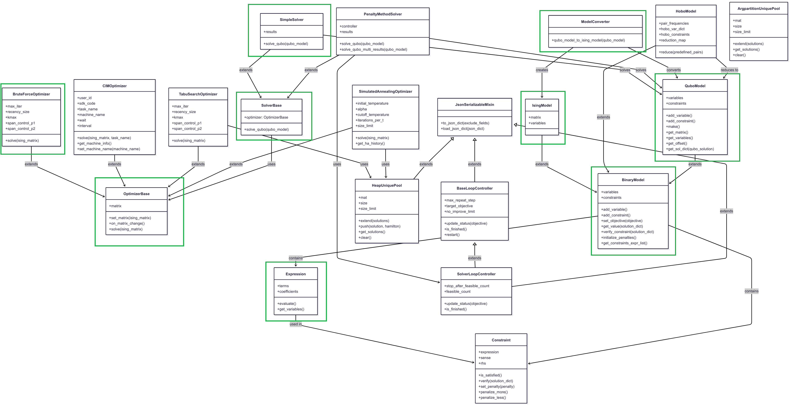

# Kaiwu SDK Community

 

**Language Versions**: [中文](README_ZH.md) | [English](README.md)

The **Kaiwu SDK Community Edition** is an open-source subset of the Kaiwu SDK. It enables users to quickly create **QUBO (Quadratic Unconstrained Binary Optimization) models**, and provides a built-in solver and optimizer for solving QUBO problems.

---

## 🚀 Prerequisites

Before using the SDK, make sure you have the following installed:

* **Python** ≥ 3.8
* **Make** (for running build/test commands)
* **Virtualenv** (optional, for isolated environments: `pip install virtualenv`)

---

## 🛠 Getting Started

Start learning how to use **CIM (Coherent Ising Machine)** with the [SDK Documentation](https://kaiwu-sdk-docs.qboson.com/en/).

> ⚠️ Note: This community edition contains only a subset of the full Kaiwu SDK.

### 1. Clone the Repository

```bash
git clone <repository-url>
cd kaiwu-sdk-community
```

### 2. Set Up the Environment

Create a virtual environment and install dependencies. You can also run linting and tests with:

```bash
make all_tests
```

---

## 📘 Example Quantum Program

To see how to solve the **Traveling Salesman Problem (TSP)** with Kaiwu SDK, check out:
[example/tsp\_sdk\_1\_2\_doc\_example.py](example/tsp_sdk_1_2_doc_example.py)

---

## 🤝 Support

* Join the [Kaiwu User Community](https://kaiwu.qboson.com/portal.php) to connect with other CIM users
* Visit the [Kaiwu SDK Help Center](https://kaiwu-sdk-docs.qboson.com/en/) for tutorials & knowledge base
* Open issues or request features on the **SDK GitHub repo** (📌 link coming soon)

---

## 🔧 Contributing

We welcome contributions! 🎉

You can extend the SDK by adding:

* New solvers
* Classical optimizers
* Implementations that leverage the **CIM machine**

Example: Creating a custom optimizer by extending `OptimizerBase`:

```python
class NewOptimizer(OptimizerBase):
    ...
```

As shown in [BruteForceOptimizer](src/kaiwu/classical/_simulated_annealing.py), you can use it with a solver:

```python
solver = kaiwu.solver.SimpleSolver(NewOptimizer())
```

➡️ See the [Contributing Guide](CONTRIBUTING.md) for full guidelines.

---

## 📜 License

This project is licensed under the **Apache License 2.0**. See the [LICENSE](LICENSE) file for details.

---

## 🏗 SDK Architecture

This open-source edition includes code for:

* **QUBO model**
* **SimpleSolver**
* **BruteForceOptimizer**

Architecture overview（the components in green box are open sourced): 


