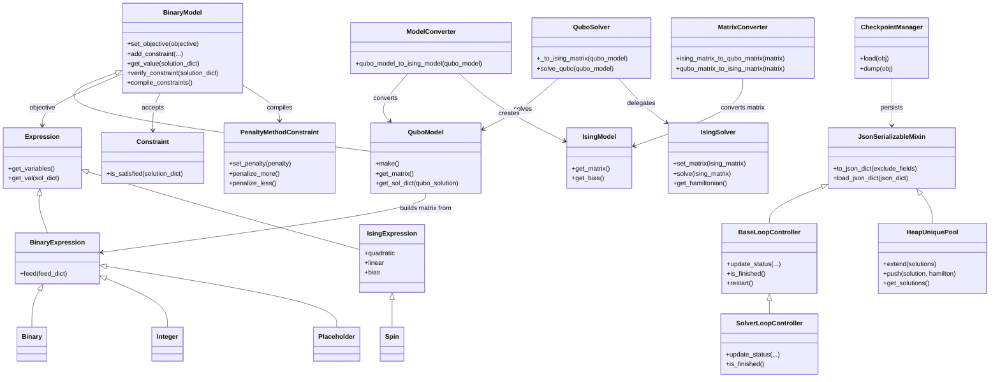
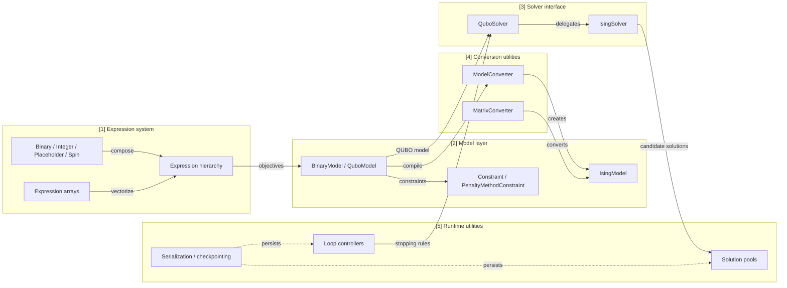

## Class Diagram

```mermaid
classDiagram
    class Expression {
        +get_variables()
        +get_val(sol_dict)
    }
    class BinaryExpression {
        +feed(feed_dict)
    }
    class IsingExpression {
        +quadratic
        +linear
        +bias
    }
    class Binary
    class Integer
    class Placeholder
    class Spin
    class BinaryModel {
        +set_objective(objective)
        +add_constraint(...)
        +get_value(solution_dict)
        +verify_constraint(solution_dict)
        +compile_constraints()
    }
    class QuboModel {
        +make()
        +get_matrix()
        +get_sol_dict(qubo_solution)
    }
    class IsingModel {
        +get_matrix()
        +get_bias()
    }
    class Constraint {
        +is_satisfied(solution_dict)
    }
    class PenaltyMethodConstraint {
        +set_penalty(penalty)
        +penalize_more()
        +penalize_less()
    }
    class IsingSolver {
        +set_matrix(ising_matrix)
        +solve(ising_matrix)
        +get_hamiltonian()
    }
    class QuboSolver {
        +_to_ising_matrix(qubo_model)
        +solve_qubo(qubo_model)
    }
    class ModelConverter {
        +qubo_model_to_ising_model(qubo_model)
    }
    class MatrixConverter {
        +ising_matrix_to_qubo_matrix(matrix)
        +qubo_matrix_to_ising_matrix(matrix)
    }
    class JsonSerializableMixin {
        +to_json_dict(exclude_fields)
        +load_json_dict(json_dict)
    }
    class BaseLoopController {
        +update_status(...)
        +is_finished()
        +restart()
    }
    class SolverLoopController {
        +update_status(...)
        +is_finished()
    }
    class HeapUniquePool {
        +extend(solutions)
        +push(solution, hamilton)
        +get_solutions()
    }
    class CheckpointManager {
        +load(obj)
        +dump(obj)
    }

    Expression <|-- BinaryExpression
    Expression <|-- IsingExpression
    BinaryExpression <|-- Binary
    BinaryExpression <|-- Integer
    BinaryExpression <|-- Placeholder
    IsingExpression <|-- Spin
    BinaryModel <|-- QuboModel
    BinaryModel --> Expression : objective
    BinaryModel --> Constraint : accepts
    BinaryModel --> PenaltyMethodConstraint : compiles
    QuboModel --> BinaryExpression : builds matrix from
    QuboSolver --> QuboModel : solves
    QuboSolver --> IsingSolver : delegates
    ModelConverter --> QuboModel : converts
    ModelConverter --> IsingModel : creates
    MatrixConverter --> IsingModel : converts matrix
    JsonSerializableMixin <|-- BaseLoopController
    BaseLoopController <|-- SolverLoopController
    JsonSerializableMixin <|-- HeapUniquePool
    CheckpointManager ..> JsonSerializableMixin : persists
```

## Module Relationship Diagram

```mermaid
flowchart LR
    subgraph ExpressionSystem["[1] Expression system"]
        Expressions["Expression hierarchy"]
        Variables["Binary / Integer / Placeholder / Spin"]
        Arrays["Expression arrays"]
    end

    subgraph ModelLayer["[2] Model layer"]
        BinaryModels["BinaryModel / QuboModel"]
        IsingModels["IsingModel"]
        Constraints["Constraint / PenaltyMethodConstraint"]
    end

    subgraph SolverInterface["[3] Solver interface"]
        QuboSolving["QuboSolver"]
        IsingSolving["IsingSolver"]
    end

    subgraph ConversionUtilities["[4] Conversion utilities"]
        ModelConversion["ModelConverter"]
        MatrixConversion["MatrixConverter"]
    end

    subgraph RuntimeUtilities["[5] Runtime utilities"]
        LoopControl["Loop controllers"]
        SolutionPools["Solution pools"]
        Persistence["Serialization / checkpointing"]
    end

    Variables -->|compose| Expressions
    Arrays -->|vectorize| Expressions
    Expressions -->|objectives| BinaryModels
    BinaryModels -->|constraints| Constraints
    BinaryModels -->|compile| ModelConversion
    ModelConversion -->|creates| IsingModels
    MatrixConversion -->|converts| IsingModels
    BinaryModels -->|QUBO model| QuboSolving
    QuboSolving -->|delegates| IsingSolving
    LoopControl -->|stopping rules| QuboSolving
    IsingSolving -->|candidate solutions| SolutionPools
    Persistence -. persists .-> LoopControl
    Persistence -. persists .-> SolutionPools
```
