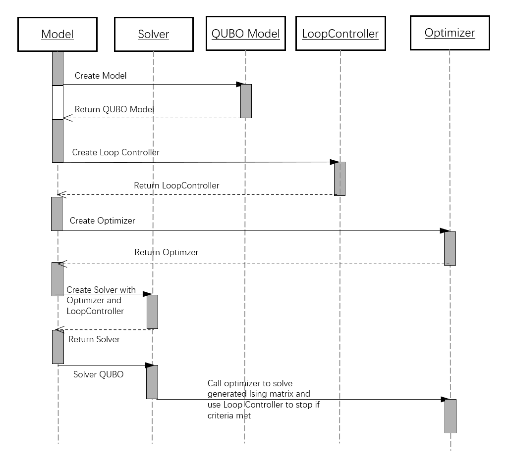

概述
====

1. 产品定位
-----------

**Kaiwu SDK 社区版** 是一套开源的软件开发套件，专为 **QUBO（二次无约束二进制优化）问题求解** 而设计。它提供了便捷的Python环境，帮助开发者快速构建QUBO模型并高效求解，加速QUBO相关应用的开发和研究。

核心价值
^^^^^^^^
- **快速建模**：简洁易用的接口，支持快速构建复杂的QUBO模型
- **灵活扩展**：模块化设计，允许开发者轻松扩展新的求解器和优化算法
- **内置工具**：包含基础求解器和优化器，支持快速验证模型效果
- **开源自由**：基于Apache 2.0许可证，完全开源，支持商业和非商业使用

2. 应用场景
-----------

Kaiwu SDK 社区版适用于多种场景，帮助不同用户解决实际问题：

.. list-table:: 
   :widths: 20 50 30
   :header-rows: 1

   * - 用户类型
     - 实际问题
     - SDK价值
   * - 研究人员
     - 探索QUBO问题建模方法，验证新优化算法性能，开展量子计算相关研究
     - 提供快速建模和求解能力，加速研究进程
   * - 开发者
     - 构建自定义QUBO求解器，开发基于QUBO的应用，集成求解功能到现有系统
     - 模块化设计，支持灵活扩展和快速开发
   * - 企业用户
     - 开发QUBO解决方案原型，优化业务流程和资源配置，探索量子计算应用
     - 降低开发成本，加速解决方案落地
   * - 学生和教育工作者
     - 学习QUBO模型和求解方法，开展量子计算实验和项目
     - 提供直观易用的工具，辅助教学和学习

3. 核心模块
-----------

Kaiwu SDK 社区版采用模块化设计，包含以下核心模块：

.. list-table:: 
   :widths: 20 40 40
   :header-rows: 1

   * - 模块名称
     - 主要功能
     - 用户价值
   * - **qubo**
     - 提供QUBO模型的构建和管理功能
     - 帮助用户快速构建QUBO模型
   * - **ising**
     - 支持Ising模型的表示和转换
     - 方便用户在QUBO和Ising模型之间转换
   * - **classical**
     - 包含经典优化算法，如BruteForceOptimizer
     - 提供基础求解能力，支持快速验证模型
   * - **solver**
     - 提供求解器框架，支持调用不同的优化器
     - 简化求解器调用流程，支持灵活扩展
   * - **core**
     - 提供核心数据结构和数学运算支持
     - 提供高效的底层计算能力
   * - **common**
     - 提供通用工具和配置管理
     - 简化开发流程，提高开发效率

4. 典型使用流程
---------------

使用Kaiwu SDK 社区版解决QUBO问题的典型流程如下：

1. **问题建模**：使用qubo模块将实际问题转化为QUBO模型
2. **模型配置**：设置模型参数和求解选项
3. **求解器选择**：选择合适的求解器或优化器
4. **模型求解**：调用solver模块对QUBO模型进行求解
5. **结果分析**：分析求解结果，验证解决方案的有效性

5. 预备知识
-----------

Ising模型
^^^^^^^^^^

伊辛模型(Ising Model)，是一类描述物质相变的随机过程模型。抽象为数学形式为：

.. math:: H(\sigma)=-\sum_{i,j}J_{ij}\sigma_i\sigma_j-\mu\sum_ih_i\sigma_i

其中\ :math:`\sigma`\ 为待求自旋变量，取值为\ :math:`\{-1,1\}`\ ， \ :math:`H`\ 为哈密顿量， \ :math:`J`\为二次项系数，\ :math:`\mu`\和\ :math:`h`\ 为线性项系数，是已知量。

QUBO模型
^^^^^^^^^^

二次无约束二值优化问题(Quadratic unconstrained binary optimization，简称QUBO)，其数学形式如下：

.. math:: f_Q(x)=\sum_{i\leqslant j}q_{ij}x_ix_j

其中\ :math:`x`\ 为待求二进制变量, 取值为\ :math:`\{0,1\}`\ , \ :math:`f`\ 为目标函数, \ :math:`q`\ 为二次项系数, 是已知量.
写成线性代数的形式:

.. math:: f_Q(\pmb x)=\pmb x^T\pmb Q\pmb x

其中, \ :math:`\pmb x`\ 为二进制向量, \ :math:`\pmb Q`\ 为QUBO矩阵, QUBO目标是找到使得\ :math:`f`\ 最小或最大的\ :math:`\pmb x`\ , 即:

.. math:: \pmb x^*=\mathop{\arg\min}\limits_{\pmb x}f_Q(\pmb x)

6. 引用方式
-----------

如果Kaiwu SDK 社区版对您的学术研究有帮助，欢迎引用：

.. code:: python

    @software{KaiwuSDKCommunity,
    title = {Kaiwu SDK Community Edition for QUBO problem solving},
    author = {{QBoson Inc.}},
    year = {2023},
    url = {https://github.com/qbosontech/kaiwu_community}
    }

或者

.. code:: python

    @misc{KaiwuSDKCommunity,
    title = {Kaiwu SDK Community Edition for QUBO problem solving},
    author = {{QBoson Inc.}},
    year = {2023},
    url = {https://github.com/qbosontech/kaiwu_community}
    }
