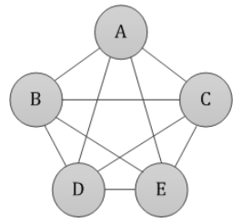
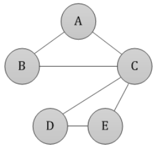

新手教程-QUBO建模-旅行商问题
^^^^^^^^^^^^^^^^^^^^^^^^^^^^^^

什么是旅行商问题
----------------

旅行商问题(TravelingSalesmanProblem，TSP)是一个经典的组合优化问题。经典的TSP可以描述为：一个商品推销员要去若干个城市推销商品，
该推销员从一个城市出发，需要经过所有城市后，回到出发地。应如何选择行进路线，以使总的行程最短。

从图论的角度来看，该问题实质是在一个带权完全无向图中，找一个权值最小的Hamilton回路。由于该问题的可行解是所有顶点的全排列，随着顶点数的增加，
会产生组合爆炸，它是一个NP完全问题。由于其在交通运输、电路板线路设计以及物流配送等领域内有着广泛的应用，国内外学者对其进行了大量的研究。
早期的研究者使用精确算法求解该问题，常用的方法包括:分支定界法、线性规划法、动态规划法等。但是，随着问题规模的增大，精确算法将变得无能为力，因此，
在后来的研究中，国内外学者重点使用近似算法或启发式算法，主要有遗传算法、模拟退火法、蚁群算法、禁忌搜索算法、贪婪算法和神经网络等。如今，
量子计算的出现为该问题的求解提供了全新的方式。

旅行商问题分析
----------------

问题本质
>>>>>>>>>

旅行商问题有一点像“最短路径问题”，然后我们就会自然地想到用Dikstra算法去求得“从某一个城市出发，到其他所有剩余城市的最短路径”，再或者如果是个真实地图，我们可以用启发式的“A星算法”快速搜索出“从某-个城市到另一个指定城市间的最短路径"。但仔细想，这个问题并非单纯这么简单，它还要求去寻找“从某个城市开始，分别经过其它城市一次且仅一次，最后再回到这个出发城市的最短巡回路径”。

深入分析
>>>>>>>>>

旅行商问题要从图G的所有周游路线中求取最小成本的周游路线，而从初始点出发的周游路线一共有(n-1)!条，即等于除初始结点外的n-1个结点的排列数，因此旅行商问题是一个排列问题。排列问题比子集合的选择问题通常要难于求解得多，这是因为n个物体有n!种排列，只有 个子集合(n!>O()）。通过枚举(n-1)!条周游路线，从中找出一条具有最小成本的周游路线的算法，其计算时间显然为O(n!)。

所以该怎么求解呢，我们很容易想到一种类似于穷举的思路：现在假设我们要拜访11个城市，从城市1出发，最后回到城市1。显然，从城市1出来后，我们随即可以选择剩余的10个城市之一进行拜访(这里所有城市都是连通的，总是可达的，而不连通的情况属于个人特殊业务的装饰处理，不是本案例考虑范畴)，那么很显然这里就有10种选择，以此类推，下一次就有9种选择.总的可选路线数就是：10!。也就是说需要用for循环迭代10!次，才能找出所有的路线，进而筛选出最短的那条路线。如果只拜访10个城市的话(需要迭代3628800次)或许还好，那要拜访100个城市(需要迭代9.3326215443944*10^157)简直就是经典计算机的噩梦！更多个城市的话，计算的时间开销可想而知！

更一般地，如果要拜访n+1个城市，总的可选路线数就是n!，进而时间复杂度就是O(n!)，从这里我们同理也可以看出，这个算法的时间复杂度是非多项式的，它的开销大是显而易见的。所以问题的关键不在于寻找两两城市间的最短路径，而在于去寻找一那条最短的巡回路径，换句话说，就是寻找一组拜访城市的先后次序序列。

旅行商求解方案
----------------

传统的旅行商求解方案主要有:

1. TSP旅行商问题-蛮力法(深度遍历优先算法DFS)
2. TSP_旅行商问题-动态规划
3. TSP旅行商问题-模拟退火算法
4. TSP 旅行商问题-遗传算法
5. TSP 旅行商问题-粒子群算法
6. TSP 旅行商问题-神经网络

旅行商问题是个NP完全问题，穷举算法的效率又不高，那我们该如何通过一个多项式时间复杂度的算法快速求出这个先后次序呢？目前比较主流的方法是采用一些随机的、启发式的搜索算法，比如遗传算法、蚁群算法、模拟退货算法、粒子群算法等。但这些算法都有一个缺点，就是不一定能求出最优解，只能收敛于(近似逼近)最优解，得到一个次优解，因为他们本质都是随机算法，大多都会以类似“一定概率接受或舍去"的思路去筛选解。各算法的实现思路都有不同，但也或多或少有互相借鉴的地方，有的与随机因子有关、有的与初始状态有关、有的与随机函数有关、有的与选择策略有关。

综合上述分析，TSP问题的求解大概是由以下两步构成：

**1.计算两两城市间的最短路径**：利用类似Diikstra、Flord、A星的算法求出最短路线。

**2.计算最短巡回路径**：利用类似遗传算法、蚁群算法的搜索算法求巡回拜访的次序。
关于1中需要说明一点，就是现实生活中我们的地图往往不是一个完全图，而是一个非完全图，甚至有些节点仅仅是道路的分岔口，而不是城市节点。完全图和非完全图的区别如下所示。

完全图和非完全图
----------------

完全图：两两城市间都有直达的路线，这条路线不需要经过中间其他节点；

非完全图：偶尔有两个城市间的路线需要经过其他中间节点。

应用量子计算求解旅行商问题
--------------------------

1. 变量定义
>>>>>>>>>>>>

| 给定一张有权重的连接图\ :math:`G(V,E)`\ ， \ :math:`V`\是节点的集合， \ :math:`E`\ 是边的集合。
| 我们使用距离矩阵来表示\ :math:`G`\ ，当两点间不存在边时，其权重值为\ :math:`0`\ 。
| 令\ :math:`N=|V|`\，\ :math:`N`\表示节点的数量。
| 令\ :math:`x_{u,j}=1`\ 代表点\ :math:`u`\ 在第\ :math:`j`\ 个点被访问，否则\ :math:`x_{u,j}=0`\ 。
| 其中\ :math:`v \in 0...N-1`, :math:`j \in 0...N-1`\ 。

2. 约束条件处理
>>>>>>>>>>>>>>>>>>

| 首先，我们需要对于每一个\ :math:`u`\ ，只对应一个顺序\ :math:`j`\ ，则有：

  .. math:: \sum_{j=0}^{N-1}x_{u,j}=1, \quad u \in 0...N-1

| 其次，我们需要对于每一个顺序\ :math:`j`\ ，只对应一个点\ :math:`u`\ ，则有：

  .. math:: \sum_{u=0}^{N-1}x_{u,j}=1, \quad j \in 0...N-1

| 将以上两个约束写成QUBO形式，有：

  .. math::  A \sum_{u=0}^{N-1} (\sum_{j=0}^{N-1}x_{u,j}-1)^2 + A \sum_{j=0}^{N-1} (\sum_{u=0}^{N-1}x_{u,j}-1)^2

| 对于\ :math:`(u,v)\notin E`\ ，我们希望\ :math:`u`\ 、\ :math:`v`\ 不连续出现在位置\ :math:`j`\ 、\ :math:`j+1`\ 上，则有：

  .. math::  A \sum_{(u,v)\notin E}(\sum_{j=0}^{N-2}x_{u,j}x_{v,j+1} + x_{u,N-1}x_{v,0})

3. QUBO模型构建
>>>>>>>>>>>>>>>>>>

| 如此，由以上的QUBO，我们可以构建一个遍历所有的点的路径的模型（又称哈密尔顿环）：

  .. math::  H_A = A \sum_{u=0}^{N-1} (\sum_{j=0}^{N-1}x_{u,j}-1)^2 + A \sum_{j=0}^{N-1} (\sum_{u=0}^{N-1}x_{u,j}-1)^2 + A \sum_{(u,v)\notin E}(\sum_{j=0}^{N-2}x_{u,j}x_{v,j+1} + x_{u,N-1}x_{v,0})

| 然而对于旅行商问题，在此基础上，我们想要获得上述路径中最短的一个。令\ :math:`w_{u,v}`\ 为边\ :math:`(u,v)`\ 的权重，则有：

  .. math::  H_B = B \sum_{(u,v)\in E}w_{u,v}(\sum_{j=0}^{N-2}x_{u,j}x_{v,j+1} + x_{u,N-1}x_{v,0})

| 将两个QUBO表达式相加，即可得到最终的优化模型：

  .. math:: H = H_A + H_B

| 优化目标是求H的最小值

4. 实现用Solver直接对QuboModel进行求解
>>>>>>>>>>>>>>>>>>>>>>>>>>>>>>>>>>>>>>>>

注：Solver求解器是针对QUBOModel的求解工具，它用QUBO Model生成Ising矩阵，使用提供的Optimizer来求解。
本例子使用一个具有基本功能的Solver来求解。

>>>>>>>>>>>>>>>>>>>>>>>>>>>>>>>>>>>>

加载依赖包

.. code:: python

    # Import numpy and kaiwu
    import numpy as np
    import pandas as pd
    import kaiwu_community as kw

加载图数据， 并做预处理。 下面的代码中定义了x变量就是模型中的决策变量\ :math:`x_{u,j}=1`\。

.. code:: python

    # Import distance matrix
    w = np.array([[0, 0, 4, 4, 2],
                  [0, 0, 4, 2, 0],
                  [4, 4, 0, 3, 3],
                  [4, 2, 3, 0, 4],
                  [2, 0, 3, 4, 0]])

    # Get the number of nodes
    n = w.shape[0]

    # Create qubo variable matrix
    x = kw.core.ndarray((n, n), "x", kw.core.Binary)

    # Get sets of edge and non-edge pairs
    edges = [(u, v) for u in range(n) for v in range(n) if w[u, v] != 0]
    no_edges = [(u, v) for u in range(n) for v in range(n) if w[u, v] == 0]

使用add_constraint加载约束项，set_objective构建目标函数。其中add_constraint需要输入penalty参数。
具体数值根据问题会有所不同。

.. code:: python

    def is_edge_used(x, u, v):
        return kw.core.quicksum([x[u, j] * x[v, j + 1] for j in range(-1, n - 1)])

    qubo_model = kw.qubo.QuboModel()
    # TSP path cost
    qubo_model.set_objective(kw.core.quicksum([w[u, v] * is_edge_used(x, u, v) for u, v in edges]))

    # Node constraint: Each node must belong to exactly one position
    qubo_model.add_constraint((x.sum(axis=0) - 1) ** 2 == 0, "sequence_cons", penalty=6.0)

    # Position constraint: Each position can have only one node
    qubo_model.add_constraint((x.sum(axis=1) - 1) ** 2 == 0, "node_cons", penalty=6.0)

    # Edge constraint: Pairs without edges cannot appear in the path
    qubo_model.add_constraint(kw.core.quicksum([is_edge_used(x, u, v) for u, v in no_edges]) == 0,
        "connect_cons", penalty=6.0)

5. 使用经典求解器进行计算
>>>>>>>>>>>>>>>>>>>>>>>>>>>>>>>>>>>>

该问题有三个硬约束（点约束、位置约束和边约束）。硬约束的取值必须严格为\ :math:`0`\ 才能形成合法的路径。

.. code:: python

    # Perform calculation using SA optimizer
    solver = kw.solver.SimpleSolver(kw.classical.BruteForceOptimizer())

    sol_dict, qubo_val = solver.solve_qubo(qubo_model)

6.计算最终路径
>>>>>>>>>>>>>>>>>>>>>>>>>>>>>>>>>>>>>>>>>>>>>>>>>>>>>>>

进一步给出求得的路径。我们使用get_val模块进行转化。

.. code:: python

    # Check the hard constraints for validity and path length
    unsatisfied_count, res_dict = qubo_model.verify_constraint(sol_dict)
    print("unsatisfied constraint: ", unsatisfied_count)
    print("value of constraint term", res_dict)

    # Calculate the path length using path_cost
    path_val = kw.core.get_val(qubo_model.objective, sol_dict)
    print('path_cost: {}'.format(path_val))

.. parsed-literal::

    unsatisfied constraint:  0
    value of constraint term {'sequence_cons(0,)': np.float64(0.0), 'sequence_cons(1,)': np.float64(0.0), 'sequence_cons(2,)': np.float64(0.0), 'sequence_cons(3,)': np.float64(0.0), 'sequence_cons(4,)': np.float64(0.0), 'node_cons(0,)': np.float64(0.0), 'node_cons(1,)': np.float64(0.0), 'node_cons(2,)': np.float64(0.0), 'node_cons(3,)': np.float64(0.0), 'node_cons(4,)': np.float64(0.0), 'connect_cons': np.float64(0.0)}
    path_cost: 15.0

以上我们获得了路径的合法性和长度，下面我们恢复\ :math:`x`\ 变量的值并获取路径。
通过get_array_val，拿到前面定义的x向量对应的值，然后通过np.array(np.nonzero(x_val.T))[1]拿到不等于0的位置索引值。就是我们要的最终结果。

.. code:: python

    if unsatisfied_count == 0:
        print('valid path')

        # Get the numerical value matrix of x
        x_val = kw.core.get_array_val(x, sol_dict)
        # Find the indices of non-zero items
        nonzero_index = np.array(np.nonzero(x_val.T))[1]
        # Print the path order
        print(nonzero_index)
    else:
        print('invalid path')

.. parsed-literal::

    valid path
    [3 1 2 4 0]

这表示路径上1号位置选择0号节点，2号位置选择1号节点，3号位置选择2号节点等等。
